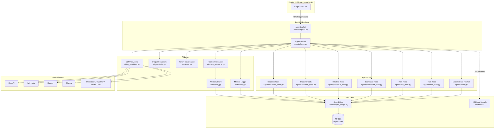
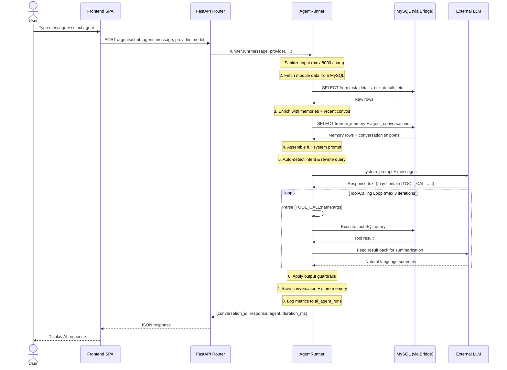
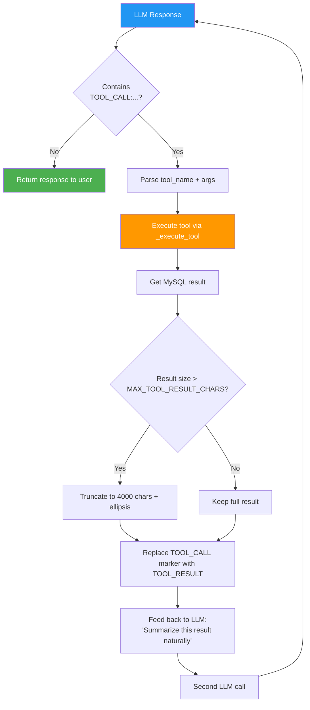
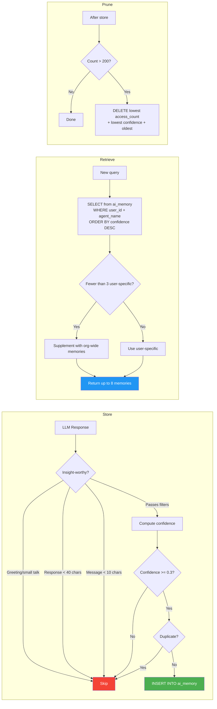
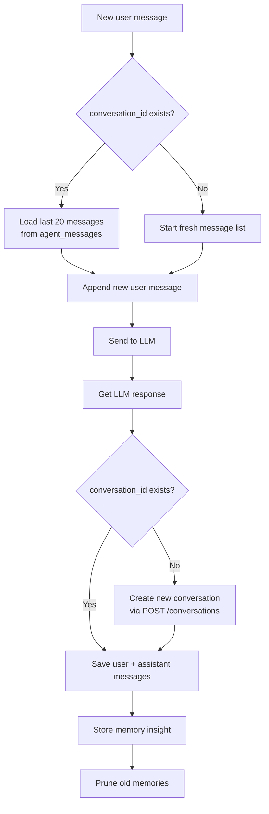
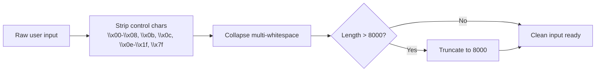
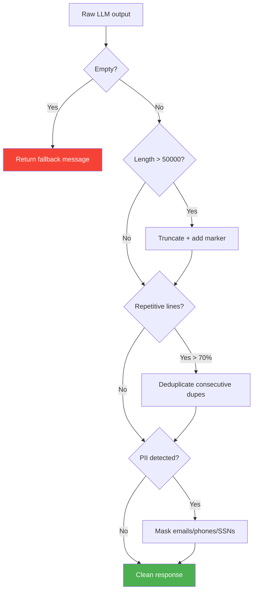

    # StratRoom Chat Engine — Data Retrieval Architecture

> **Version:** 1.0 — August 2026  
> **Scope:** End-to-end data flow from user query to LLM response  
> **Source files:** `backend/app/agents/`, `backend/app/ai/`, `backend/app/routers/agents.py`

---

## Table of Contents

1. [Executive Summary](#1-executive-summary)
2. [Architecture Overview Diagram](#2-architecture-overview-diagram)
3. [End-to-End Data Flow (Step-by-Step)](#3-end-to-end-data-flow-step-by-step)
4. [Database Retrieval Layer](#4-database-retrieval-layer)
5. [Context & Prompt Assembly](#5-context--prompt-assembly)
6. [Tool-Calling Mechanism](#6-tool-calling-mechanism)
7. [Agent-Module Interaction Matrix](#7-agent-module-interaction-matrix)
8. [Memory & Conversation System](#8-memory--conversation-system)
9. [Output Guardrails & Token Governance](#9-output-guardrails--token-governance)
10. [MySQL Schema Reference (AI Tables)](#10-mysql-schema-reference-ai-tables)

---

## 1. Executive Summary

StratRoom's chat engine is a **tool-calling agent architecture**, not a vector-based RAG system. There are no embeddings, no vector stores (Chroma/FAISS/Pinecone), and no LangChain. Instead:

- The **LLM** receives a system prompt containing module-specific instructions and live organizational data.
- The LLM issues `[TOOL_CALL:tool_name:args]` markers in its response.
- The **server** parses these markers, executes MySQL queries via tool functions, and feeds the results back to the LLM.
- The LLM then produces a natural-language summary of the tool results for the user.

**Long-term context** is provided by a MySQL-backed memory system (`ai_memory` table) that stores confidence-scored insights from past conversations, serving a similar role to vector retrieval but via SQL rather than similarity search.

---

## 2. Architecture Overview Diagram

### 2.1 High-Level System Architecture



### 2.2 Request Lifecycle (Simplified)



---

## 3. End-to-End Data Flow (Step-by-Step)

The entire pipeline lives in `AgentRunner.run()` (`backend/app/agents/base.py:39-240`). Here is every step in execution order:

### Step 1 — Input Sanitization

**File:** `ai/tokens.py:39-56` (`sanitize_input`)

```python
user_message, _in_truncated = sanitize_input(user_message)
```

- Strips control characters (`\x00-\x08`, `\x0b`, `\x0c`, `\x0e-\x1f`, `\x7f`)
- Collapses multi-whitespace
- Truncates to `MAX_CHAT_INPUT_CHARS` (default: **8,000** characters)
- Input is also pre-validated in the Pydantic model (`routers/agents.py:48-61`) with `valid_input_chars()` and length checks

### Step 2 — Module Data Fetch (Organizational Context)

**File:** `agents/tools.py:204-220` (`fetch_agent_context`)

```python
context = await fetch_agent_context(db, self.agent_name, org_id, ctx)
```

This is the **primary data retrieval step**. It:

1. Looks up which modules the agent can access via `AGENT_MODULE_MAP` (`tools.py:82-98`)
2. Resolves the caller's MySQL `emp_id` from their email via `_resolve_emp_id()` (`tools.py:101-114`)
3. For each module, calls `fetch_module_data()` which tries the MySQL bridge first

The bridge path mapping (`tools.py:10-25`):

| Module | Bridge Path | MySQL Table |
|--------|------------|-------------|
| risks | `/riskListView` | `risk_details` |
| incidents | `/universalIncidentList` | `universal_incident` |
| scorecards | `/scoreCardList` | `score_card` |
| budgets | `/budgetsListview` | `budget_detail` |
| tasks | `/retrieveTaskList/` | `task_details` |
| meetings | `/meetingManagementList/` | `meeting_management` |
| audit | `/auditManagementList` | `audit_management` |
| compliance | `/compliance` | `compliance_details` |
| initiatives | `/initiativesList/` | `initiatives_details` |
| projects | `/projectsList` | `projects_details` |
| swot | `/swotList` | `swot_details` |
| pestel | `/pestelList` | `pestel_details` |
| bcp | `/bcpList` | `bcp_details` |
| decisions | `/decisions` | `decisions` |

Each bridge path is translated to a raw MySQL SELECT by `JavaBridge._route_db_get()` (`services/java_bridge.py:81-120`). The bridge uses `pymysql` with `DictCursor`, parameterized queries (`%s` placeholders), and a shared connection with auto-reconnect.

**Task scoping:** For the `tasks` module, if the caller's `emp_id` is resolved, a scoped query fetches only their tasks (`tools.py:117-156`):

```sql
SELECT t.ID, t.task_value, t.owner, t.priority, t.status
FROM task_details t
WHERE t.owner = %s
ORDER BY FIELD(t.priority, 'Critical', 'High', 'Medium', 'Low'), t.ID
```

Otherwise, it falls back to the unscoped bridge fetch.

### Step 3 — Memory & Conversation Enrichment

**File:** `ai/query_enhancer.py:18-61` (`enhance_context`)

```python
enhanced = await enhance_context(
    agent_name=self.agent_name,
    user_id=user_id, org_id=org_id,
    user_message=user_message,
    conversation_id=conversation_id,
)
```

This builds an enriched context block from three sources:

**Source A — Long-term memories** (`ai/memory.py:105-150`):

```sql
-- User-specific memories first
SELECT id, insight, confidence, source, created_at, access_count
FROM ai_memory
WHERE user_id = %s AND agent_name = %s
ORDER BY confidence DESC, accessed_at DESC LIMIT %s

-- Fallback: org-wide memories if fewer than 3 user-specific
SELECT id, insight, confidence, source, created_at, access_count
FROM ai_memory
WHERE org_id = %s AND agent_name = %s
AND (user_id IS NULL OR user_id != %s)
ORDER BY confidence DESC, accessed_at DESC LIMIT %s
```

Returns up to 8 memories ranked by confidence then recency.

**Source B — Recent conversation summaries** (`ai/query_enhancer.py:64-103`):

```sql
-- Get up to 3 most recent conversations for this agent+user
SELECT c.id, c.title, c.created_at
FROM agent_conversations c
WHERE c.agent_name = %s AND c.user_id = %s
ORDER BY c.created_at DESC LIMIT 3

-- For each conversation, get last 3 messages
SELECT role, content FROM agent_messages
WHERE conversation_id = %s ORDER BY id DESC LIMIT 3
```

Messages are truncated to 150 chars each and formatted as `User: ... | Agent: ...`.

**Source C — Org context hint:**

```
--- CONTEXT ---
Organization ID: {org_id} | Agent: {agent_name}
```

### Step 4 — System Prompt Assembly

**File:** `agents/base.py:73-76`

The final system prompt is assembled in three parts:

```
{AGENT_PROMPTS[agent_name]}           ← Step 4a: Agent-specific persona + tool docs
\n\n{enhanced}                         ← Step 4b: Memories + recent convos + org hint
\n\n--- CURRENT ORGANIZATION DATA ---\n{context}  ← Step 4c: Live module data
```

**Step 4a** loads from `AGENT_PROMPTS` (`agents/prompts.py:1-346`), which defines 12 agent personas. Each prompt includes:
- Role description and capabilities
- Available tools with `[TOOL_CALL:...]` syntax documentation
- Response formatting instructions

**Step 4c** truncates context to `MAX_PROMPT_LENGTH` (default: **50,000** characters) if it exceeds the limit (`base.py:57-58`).

### Step 5 — Conversation History Load

**File:** `agents/base.py:79-81`

```python
if conversation_id:
    history = await self._load_history(conversation_id)
    messages = history
```

Loads the last **20 messages** from `agent_messages` via the Java DB service HTTP endpoint (`base.py:729-735`). This gives the LLM continuity across turns.

### Step 6 — Intent Auto-Detection & Query Rewriting

**File:** `agents/base.py:84-89`, `agents/base.py:243-371` (`_auto_fetch_tool`)

Before sending to the LLM, the system detects common intents and rewrites confusing queries:

| Pattern Detected | Rewritten To |
|-----------------|--------------|
| "my tasks" / "assigned to me" | `query_tasks` with `owner=<caller_email>` |
| "high priority" / "critical tasks" | `query_tasks` with `priority=Critical+High` |
| "tasks assigned to dominic" | `query_tasks` with `owner=Dominic` |
| "all tasks" / "list tasks" | `query_tasks` with no filters |
| "update task 102 to 80%" | `update_task_progress` with `id=102,progress=80` |
| "mark task 102 as completed" | `update_task_status` with `id=102,status=completed` |
| "update initiative 8 progress to 80%" | `update_initiative_progress` with `id=8,progress=80` |
| "show all initiatives" | `query_initiatives` tool call |

The rewriting is **agent-aware**: initiative patterns run for ALL agents (to prevent misrouting), while task patterns only run for the `task` agent.

### Step 7 — First LLM Call

**File:** `ai/llm_providers.py:160-200` (`call_llm_with_retry`)

```python
response_text, retry_count = await call_llm_with_retry(
    provider=provider, api_key=api_key, model=model,
    system_prompt=full_system, messages=messages,
    base_url=base_url,
)
```

The LLM gateway supports **11 providers** with provider-specific adapters:

| Provider | Endpoint | Protocol |
|----------|----------|----------|
| OpenAI | `api.openai.com/v1/chat/completions` | OpenAI-compatible |
| Anthropic | `api.anthropic.com/v1/messages` | Anthropic native |
| Google | `generativelanguage.googleapis.com` | Gemini native |
| DeepSeek | `api.deepseek.com/v1/chat/completions` | OpenAI-compatible |
| Together | `api.together.xyz/v1/chat/completions` | OpenAI-compatible |
| Mistral | `api.mistral.ai/v1/chat/completions` | OpenAI-compatible |
| xAI | `api.x.ai/v1/chat/completions` | OpenAI-compatible |
| Moonshot | `api.moonshot.cn/v1/chat/completions` | OpenAI-compatible |
| Ollama | `localhost:11434/api/chat` | Ollama native |
| Qwen | Routes through Together API | OpenAI-compatible |
| Mock | Local mock response | Testing |

**Retry logic:** Up to 2 retries with exponential backoff (`2^attempt` seconds, +0.5s for rate limits). Retryable errors: `HTTPStatusError`, `ConnectTimeout`, `ReadTimeout`, `ConnectError`, `PoolTimeout`, `RemoteProtocolError`.

**Token clamping:** `max_tokens` is clamped to `MAX_LLM_MAX_TOKENS` (default: **2,048**) via `_clamp_max_tokens()` (`llm_providers.py:94-106`).

### Step 8 — Tool-Calling Loop (Max 3 Iterations)

**File:** `agents/base.py:110-161`



**Tool call parsing** (`base.py:31`):

```python
_TOOL_CALL_RE = re.compile(r"\[TOOL_CALL:([^\]:]+)(?::([^\]]*))?\]")
```

Format: `[TOOL_CALL:tool_name:key1=value1,key2=value2]`

**Tool execution** (`base.py:374-712`): The `_execute_tool` method parses the `key=value` arguments, then dispatches to the appropriate tool function. Argument parsing (`base.py:395-412`) splits on commas, splits on `=`, and attempts `int` conversion.

**Result feedback** (`base.py:142-151`): The tool result is injected into the conversation as:

```
The tool '{tool_name}' returned the following result.
Summarize it naturally for the user. If the user asked to update something,
confirm the change was saved to the database.

[TOOL_RESULT]{result_summary}[/TOOL_RESULT]
```

The loop runs **maximum 3 iterations** — allowing multi-step tool chains (e.g., query risks → create mitigation task → summarize).

### Step 9 — Output Guardrails

**File:** `ai/guardrails.py:22-52` (`validate_response`)

Applied **after** the tool loop completes:

| Check | Threshold | Action |
|-------|-----------|--------|
| Empty response | `len < 5` | Return safe fallback message |
| Excess length | `> 50,000 chars` | Truncate with marker |
| Repetitive lines | `> 70% duplicate lines` | Deduplicate consecutive duplicates |
| Trigram repetition | `> 40% duplicate trigrams` | Log warning (non-blocking) |
| PII detection | Email/phone/SSN patterns | Mask with `[REDACTED_*]` |

Guardrails are **non-destructive** — they never crash the pipeline. If triggered, the counter is incremented (`counters.record_guardrail_block()`) and the cleaned response is used.

### Step 10 — Conversation Persistence & Memory Storage

**File:** `agents/base.py:196-225`

1. **Create conversation** if none exists (`base.py:196-201`): `POST /conversations` with agent_name, user_id, org_id
2. **Save both messages** (`base.py:203-208`): user message + assistant response, truncated to 50,000 chars each
3. **Store memory insight** (`ai/memory.py:59-102`):
   - Filters trivial exchanges (greetings, small talk) via regex patterns
   - Filters responses < 40 chars and messages < 10 chars
   - Computes confidence score (0.0-1.0) based on data richness:
     - Base: 0.4
     - Contains digits: +0.15
     - Contains `%` or `$`: +0.1
     - Contains keywords (recommend, should, priority, risk, critical): +0.15
     - Response > 200 chars: +0.1
     - Message > 30 chars: +0.1
   - Rejects if confidence < 0.3
   - Deduplicates by checking first 80 chars against existing entries
   - Stores in `ai_memory` with `user_id`, `org_id`, `agent_name`, `insight`, `confidence`
4. **Prune memory** (`ai/memory.py:166-205`): If count exceeds 200 per agent, deletes oldest/least-accessed entries

### Step 11 — Metrics Logging

**File:** `ai/metrics.py:71-102` (`log_agent_run`)

Inserts a row into `ai_agent_runs`:

```sql
INSERT INTO ai_agent_runs
(org_id, user_id, agent_name, provider, model, conversation_id,
 status, duration_ms, token_count, error_message)
VALUES (%s, %s, %s, %s, %s, %s, %s, %s, %s, %s)
```

Also updates in-memory counters (total/successful/failed requests, retries, tool failures, memory failures, guardrail blocks).

---

## 4. Database Retrieval Layer

### 4.1 Connection Architecture

**File:** `services/java_bridge.py:24-77`

The `JavaBridge` class maintains:

- A **synchronous `pymysql` connection** with `DictCursor`, auto-reconnect, and `autocommit=True`
- An **async lock** (`_mysql_lock`) ensuring serialized MySQL access (single-threaded query execution)
- Queries run via `asyncio.to_thread()` to avoid blocking the event loop

```python
async def _mysql(self, sql, params=(), one=False):
    async with self._mysql_lock:
        fn = self._query_one if one else self._query_all
        return await asyncio.to_thread(fn, sql, params)
```

**Write operations** use `bridge._mysql_write()` which wraps `_mysql()` and returns the last insert ID.

### 4.2 Bridge Path → MySQL Routing

**File:** `services/java_bridge.py:81-120` (`_route_db_get`)

The bridge intercepts known HTTP GET paths and translates them directly to MySQL queries, bypassing the Java service entirely:

```
/riskListView        → SELECT ... FROM risk_details
/budgetsListview     → SELECT ... FROM budget_detail
/universalIncidentList → SELECT ... FROM universal_incident
/decisions           → SELECT ... FROM decisions
/initiativesList/    → SELECT ... FROM initiatives_details
/auditManagementList → SELECT ... FROM audit_management
/retrieveTaskList/   → SELECT ... FROM task_details
/meetingManagementList/ → SELECT ... FROM meeting_management
/compliance          → SELECT ... FROM compliance_details
/scoreCardList       → SELECT ... FROM score_card
/findByUser          → SELECT ... FROM employee_details WHERE email = ?
/employeeDetailsList → SELECT ... FROM employee_details
/swotList            → SELECT ... FROM swot_details
/pestelList          → SELECT ... FROM pestel_details
```

Unknown paths fall through to HTTP calls to the Java microservices (ports 9010-9060).

### 4.3 RBAC Filtering Patterns

All tool functions implement **role-based access control**:

**Admin users** see all data across orgs (unscoped queries):

```sql
-- Admin task query (no WHERE clause on org)
SELECT t.ID, t.task_value, t.owner, t.priority, t.status
FROM task_details t
ORDER BY FIELD(t.priority, 'Critical', 'High', 'Medium', 'Low'), t.ID
```

**Member users** are scoped via `employee_details` JOIN:

```sql
-- Member task query (org + ownership scoped)
SELECT t.ID, t.task_value, t.owner, t.priority, t.status
FROM task_details t
JOIN employee_details e ON e.emp_id = t.owner
WHERE e.org_id = %s AND t.owner = %s
ORDER BY FIELD(t.priority, 'Critical', 'High', 'Medium', 'Low'), t.ID
```

**Identity resolution** always starts with email → emp_id lookup:

```sql
SELECT emp_id, org_id FROM employee_details
WHERE LOWER(email_address) = LOWER(%s) LIMIT 1
```

**Scorecard RBAC** adds an additional `assigned_user_id` filter for non-admin, non-manager users (`scorecard_tools.py:60-61`).

### 4.4 JSON Blob Pattern

Most MySQL tables store structured data in a JSON column (e.g., `task_value`, `risk_value`, `initiative_value`, `incident_value`, `decision_value`). The bridge parses these via `bridge._parse_json_col()`. When updating, the full JSON blob is read, merged with changes, and written back.

---

## 5. Context & Prompt Assembly

### 5.1 Agent System Prompts

**File:** `agents/prompts.py:1-346`

12 agent personas are defined in the `AGENT_PROMPTS` dictionary:

| Agent | Persona | Write Tools |
|-------|---------|-------------|
| `strategy` | Strategic alignment, KPI performance, initiatives | `query_scorecards`, `query_decisions`, `create_decision`, `update_decision_status` |
| `risk` | Risk register, audit findings, compliance posture | `query_risks`, `create_risk`, `update_risk`, `delete_risk`, `create_risk_mitigation_task`, `create_task`, `risk_simulator` |
| `scorecard` | Balanced Scorecard, KPI trends, strategic alignment | `query_scorecards`, `update_scorecard`, `create_scorecard`, `delete_scorecard`, `query_tasks`, `update_task_progress` |
| `finance` | Budgets, spending patterns, cost efficiency | **None** (read-only) |
| `compliance` | Regulatory status, governance posture | **None** (read-only) |
| `audit` | Audit findings, remediation progress | **None** (read-only) |
| `task` | Task execution, status management | `query_tasks`, `update_task_progress`, `update_task_status`, `create_task`, `query_initiatives`, `update_initiative_progress` |
| `meetings` | Meeting schedules, agendas, action items | **None** (read-only) |
| `projects` | Initiatives, project progress, budgets | `query_initiatives`, `update_initiative_progress` |
| `incident` | Incident triage, severity, escalation | `update_incident_status`, `create_task`, `query_scorecards`, `query_risks` |
| `decision` | Decision register, approvals | `query_decisions`, `create_decision`, `update_decision_status` |
| `executive` | CEO/C-suite cross-domain summaries | **None** (read-only) |

### 5.2 Module Access Map

**File:** `agents/tools.py:82-98` (`AGENT_MODULE_MAP`)

Each agent has access to specific data modules for context injection:

```
strategy  → scorecards, initiatives, projects, swot, pestel, tasks
risk      → risks, audit, compliance
scorecard → scorecards, initiatives, projects, tasks
finance   → budgets, scorecards, initiatives
compliance → compliance, audit, risks
audit     → audit, compliance, risks
task      → tasks
meetings  → meetings, tasks, initiatives
projects  → initiatives, projects, budgets
incident  → incidents, risks, compliance
decision  → decisions, risks, incidents
executive → scorecards, initiatives, projects, risks, incidents,
            budgets, compliance, audit, swot, pestel
```

### 5.3 Context Block Format

The final system prompt structure looks like this (with actual data injected):

```
You are the Risk Agent for StratRoom, an enterprise governance platform.
You analyze the organization's risk register, audit findings, and compliance posture.
...

## Available Tools
You have access to risk management tools. Use them when the user asks to:
- View risks, check heat scores, see risk register
...

--- RELEVANT MEMORIES ---
- [0.85] Top 3 risks by heat score are Cyber Breach (20/25), Vendor Lock-in (15/25), ...
- [0.70] Recommended deploying MFA for the Mankayane Branch security risk.

--- RECENT CONVERSATIONS ---
[Risk Analysis Chat]: User: Show me critical risks | Agent: Here are the top 3 critical risks...

--- CONTEXT ---
Organization ID: 5 | Agent: risk

--- CURRENT ORGANIZATION DATA ===
=== RISK AGENT DATA ===

--- RISKS ---
ID=42 | risk_value={"name":"Cyber Breach","score":"20",...} | owner=101 | status=APPROVED
ID=43 | risk_value={"name":"Vendor Lock-in","score":"15",...} | owner=105 | status=APPROVED
...

--- AUDIT ---
ID=7 | managementvalue={...} | owner=101 | active=1
...

--- COMPLIANCE ---
ID=12 | complain_value={...} | status=Compliant | risklevel=Low
...
```

### 5.4 Token & Character Limits

**File:** `core/config.py:46-56`

| Parameter | Default | Purpose |
|-----------|---------|---------|
| `MAX_CHAT_INPUT_CHARS` | 8,000 | Max user message length |
| `MAX_PROMPT_LENGTH` | 50,000 | Max total system prompt (context block) |
| `MAX_RESPONSE_CHARS` | 16,000 | Hard output cap on LLM response |
| `MAX_LLM_MAX_TOKENS` | 2,048 | Provider `max_tokens` ceiling |
| `MAX_TOOL_RESULT_CHARS` | 4,000 | Max tool result fed back to LLM |

---

## 6. Tool-Calling Mechanism

### 6.1 Tool Call Protocol

The LLM emits tool calls as inline text markers:

```
[TOOL_CALL:query_risks:min_heat=10]
[TOOL_CALL:create_task:title=Deploy MFA,owner=dominic@demo.com,priority=High]
[TOOL_CALL:update_task_status:id=102,status=completed]
```

**Format:** `[TOOL_CALL:{tool_name}:{key1}={value1},{key2}={value2}]`

The regex parser (`base.py:31`):

```python
_TOOL_CALL_RE = re.compile(r"\[TOOL_CALL:([^\]:]+)(?::([^\]]*))?\]")
```

- Group 1: tool name (e.g., `query_risks`)
- Group 2: optional args string (e.g., `min_heat=10`)

### 6.2 Argument Parsing

**File:** `agents/base.py:395-412` (`_parse_kv`)

```python
def _parse_kv(args_raw: str) -> dict:
    result = {}
    for p in args_raw.split(","):
        if "=" in p:
            k, v = p.split("=", 1)
            try:
                v = int(v)  # Auto-cast to int when possible
            except ValueError:
                pass
            result[k.strip()] = v.strip() if isinstance(v, str) else v
    return result
```

### 6.3 Complete Tool Inventory

| Tool Name | File | MySQL Table | Operation |
|-----------|------|-------------|-----------|
| `query_tasks` | `task_tools.py:87` | `task_details` | SELECT (with RBAC) |
| `update_task_status` | `task_tools.py:276` | `task_details` | UPDATE (status column + JSON) |
| `update_task_progress` | `task_tools.py:424` | `task_details` | UPDATE (progress in JSON, auto-status) |
| `create_task` | `task_tools.py:574` | `task_details` | INSERT |
| `create_risk_mitigation_task` | `task_tools.py:698` | `task_details` + `risk_details` | INSERT (linked task) |
| `query_risks` | `risk_tools.py:22` | `risk_details` | SELECT (with RBAC) |
| `create_risk` | `risk_tools.py:146` | `risk_details` | INSERT |
| `update_risk` | `risk_tools.py:299` | `risk_details` | UPDATE (JSON blob merge) |
| `delete_risk` | `risk_tools.py:497` | `risk_details` | DELETE (admin only) |
| `risk_simulator` | `risk_tools.py:588` | `risk_details` | SELECT → Monte Carlo simulation |
| `query_scorecards` | `scorecard_tools.py:46` | `scorecard_kpis` | SELECT (deduped, junk-filtered) |
| `query_scorecard_summary` | `scorecard_tools.py:111` | `scorecard_kpis` | SELECT (aggregated) |
| `create_scorecard` | `scorecard_tools.py:164` | `scorecard_kpis` | INSERT |
| `update_scorecard` | `scorecard_tools.py:219` | `scorecard_kpis` | UPDATE |
| `delete_scorecard` | `scorecard_tools.py:304` | `scorecard_kpis` | DELETE (admin only) |
| `query_initiatives` | `initiative_tools.py:47` | `initiatives_details` | SELECT (with RBAC) |
| `update_initiative_progress` | `initiative_tools.py:114` | `initiatives_details` | UPDATE (JSON blob) |
| `update_incident_status` | `incident_tools.py:44` | `universal_incident` | UPDATE (nested JSON) |
| `query_decisions` | `decision_tools.py:60` | `decisions` | SELECT (with RBAC) |
| `create_decision` | `decision_tools.py:125` | `decisions` | INSERT |
| `update_decision_status` | `decision_tools.py:219` | `decisions` | UPDATE (column + JSON) |

### 6.4 ML Prediction Tools (Registry)

**File:** `ai/tool_registry.py:52-172`

Six XGBoost-based prediction models are registered but invoked via a separate ML tool registry (not through the `[TOOL_CALL:...]` mechanism):

| Tool | Model File | Description |
|------|-----------|-------------|
| `predict_risk` | `risk_model.joblib` | Residual risk score prediction |
| `predict_revenue` | `revenue_model.joblib` | Revenue attainment % |
| `predict_attrition` | `attrion_model.joblib` | Employee attrition probability |
| `predict_incidents` | `incident_model.joblib` | Security incident count |
| `predict_budget_variance` | `budget_model.joblib` | Budget variance % |
| `run_full_forecast` | All 5 models | Composite forecast |

---

## 7. Agent-Module Interaction Matrix

This table shows which data modules each agent can access for **context injection** (Step 2) and which have **write tools** available.

| Agent | Read Modules | Write Tools | Total Tools |
|-------|-------------|-------------|-------------|
| **strategy** | scorecards, initiatives, projects, swot, pestel, tasks | query_scorecards, query_scorecard_summary, query_decisions, create_decision, update_decision_status | 5 |
| **risk** | risks, audit, compliance | query_risks, create_risk, update_risk, delete_risk, create_risk_mitigation_task, create_task, risk_simulator | 7 |
| **scorecard** | scorecards, initiatives, projects, tasks | query_scorecards, query_scorecard_summary, update_scorecard, create_scorecard, delete_scorecard, query_tasks, update_task_progress | 7 |
| **finance** | budgets, scorecards, initiatives | *(none)* | 0 |
| **compliance** | compliance, audit, risks | *(none)* | 0 |
| **audit** | audit, compliance, risks | *(none)* | 0 |
| **task** | tasks | query_tasks, update_task_progress, update_task_status, create_task, query_initiatives, update_initiative_progress | 6 |
| **meetings** | meetings, tasks, initiatives | *(none)* | 0 |
| **projects** | initiatives, projects, budgets | query_initiatives, update_initiative_progress | 2 |
| **incident** | incidents, risks, compliance | update_incident_status, create_task, query_scorecards, query_risks | 4 |
| **decision** | decisions, risks, incidents | query_decisions, create_decision, update_decision_status | 3 |
| **executive** | scorecards, initiatives, projects, risks, incidents, budgets, compliance, audit, swot, pestel | *(none)* | 0 |

---

## 8. Memory & Conversation System

### 8.1 Memory Lifecycle



### 8.2 Conversation History Flow



### 8.3 MySQL Tables

| Table | Purpose | Key Columns |
|-------|---------|-------------|
| `agent_conversations` | Chat session metadata | `id`, `agent_name`, `user_id`, `org_id`, `title`, `created_at` |
| `agent_messages` | Individual chat messages | `id`, `conversation_id`, `role`, `content`, `created_at` |
| `ai_memory` | Long-term insight storage | `id`, `user_id`, `org_id`, `agent_name`, `insight`, `confidence`, `access_count` |
| `ai_agent_runs` | Per-call observability | `id`, `agent_name`, `provider`, `model`, `status`, `duration_ms`, `token_count` |

---

## 9. Output Guardrails & Token Governance

### 9.1 Input Sanitization Pipeline



### 9.2 Output Validation Pipeline



### 9.3 Token Estimation

**File:** `ai/tokens.py:26-36`

The system uses a **chars/4 heuristic** (no heavyweight tokenizer):

```python
def estimate_tokens(text):
    return max(1, len(text) // 4)
```

The `TokenBenchmark` class maintains a rolling window of 200 responses for monitoring average token consumption per agent.

---

## 10. MySQL Schema Reference (AI Tables)

### `ai_agent_runs`

```sql
CREATE TABLE ai_agent_runs (
    id INT NOT NULL AUTO_INCREMENT,
    org_id INT DEFAULT NULL,
    user_id INT DEFAULT NULL,
    agent_name VARCHAR(100) DEFAULT NULL,
    provider VARCHAR(50) DEFAULT NULL,
    model VARCHAR(200) DEFAULT NULL,
    conversation_id INT DEFAULT NULL,
    status VARCHAR(20) DEFAULT NULL,        -- 'success' or 'error'
    duration_ms INT DEFAULT NULL,
    token_count INT DEFAULT NULL,
    error_message TEXT,
    created_at TIMESTAMP NULL DEFAULT CURRENT_TIMESTAMP,
    PRIMARY KEY (id)
) ENGINE=InnoDB DEFAULT CHARSET=utf8mb4;
```

### `ai_memory`

```sql
CREATE TABLE ai_memory (
    id INT NOT NULL AUTO_INCREMENT,
    user_id INT DEFAULT NULL,
    org_id INT DEFAULT NULL,
    agent_name VARCHAR(100) DEFAULT NULL,
    insight TEXT,                            -- The stored insight (max 5000 chars)
    source VARCHAR(100) DEFAULT NULL,        -- e.g. 'conversation:42'
    confidence FLOAT DEFAULT NULL,           -- 0.0 to 1.0
    created_at TIMESTAMP NULL DEFAULT CURRENT_TIMESTAMP,
    accessed_at TIMESTAMP NULL DEFAULT CURRENT_TIMESTAMP ON UPDATE CURRENT_TIMESTAMP,
    access_count INT DEFAULT '0',            -- Incremented on retrieval
    PRIMARY KEY (id)
) ENGINE=InnoDB DEFAULT CHARSET=utf8mb4;
```

### `agent_conversations`

```sql
CREATE TABLE agent_conversations (
    id INT AUTO_INCREMENT PRIMARY KEY,
    agent_name VARCHAR(255) NOT NULL,
    user_id INT NOT NULL,
    org_id INT NOT NULL,
    title VARCHAR(500),
    created_at DATETIME NOT NULL DEFAULT CURRENT_TIMESTAMP,
    INDEX idx_agent_conv_user (user_id),
    INDEX idx_agent_conv_agent (agent_name),
    INDEX idx_agent_conv_org (org_id)
) ENGINE=InnoDB DEFAULT CHARSET=utf8mb4;
```

### `agent_messages`

```sql
CREATE TABLE agent_messages (
    id INT AUTO_INCREMENT PRIMARY KEY,
    conversation_id INT NOT NULL,
    role VARCHAR(20) NOT NULL,              -- 'user' or 'assistant'
    content TEXT NOT NULL,
    created_at DATETIME NOT NULL DEFAULT CURRENT_TIMESTAMP,
    INDEX idx_agent_msg_conv (conversation_id)
) ENGINE=InnoDB DEFAULT CHARSET=utf8mb4;
```

---

## Appendix: File Reference

| File | Lines | Role |
|------|-------|------|
| `backend/app/agents/base.py` | 735 | **Central orchestrator** — `AgentRunner.run()` |
| `backend/app/agents/tools.py` | 220 | Module data fetcher + `AGENT_MODULE_MAP` |
| `backend/app/agents/prompts.py` | 346 | System prompts for all 12 agents |
| `backend/app/agents/task_tools.py` | 785 | Task CRUD tools |
| `backend/app/agents/risk_tools.py` | 617 | Risk CRUD + Monte Carlo simulator |
| `backend/app/agents/scorecard_tools.py` | 356 | Scorecard/KPI CRUD |
| `backend/app/agents/initiative_tools.py` | 227 | Initiative query + progress update |
| `backend/app/agents/incident_tools.py` | 172 | Incident status/severity update |
| `backend/app/agents/decision_tools.py` | 357 | Decision register CRUD |
| `backend/app/ai/llm_providers.py` | 285 | Multi-provider LLM gateway |
| `backend/app/ai/memory.py` | 205 | Long-term memory store/retrieve/prune |
| `backend/app/ai/query_enhancer.py` | 106 | Context enrichment pre-LLM |
| `backend/app/ai/guardrails.py` | 108 | Output validation + PII masking |
| `backend/app/ai/tokens.py` | 154 | Token estimation + I/O bounds |
| `backend/app/ai/metrics.py` | 102 | Observability counters + DB logging |
| `backend/app/ai/tool_registry.py` | 172 | ML prediction tool registry |
| `backend/app/routers/agents.py` | 651 | HTTP endpoints (`/agents/*`) |
| `backend/app/services/java_bridge.py` | 899 | MySQL bridge + HTTP proxy |
| `backend/app/core/config.py` | 123 | All configuration settings |
